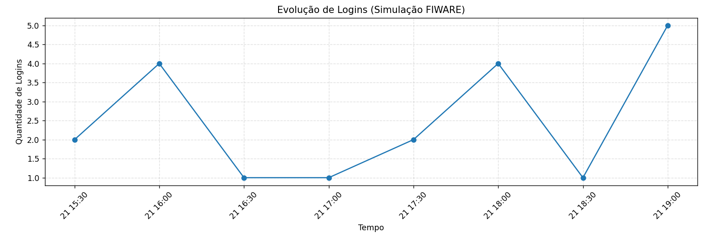
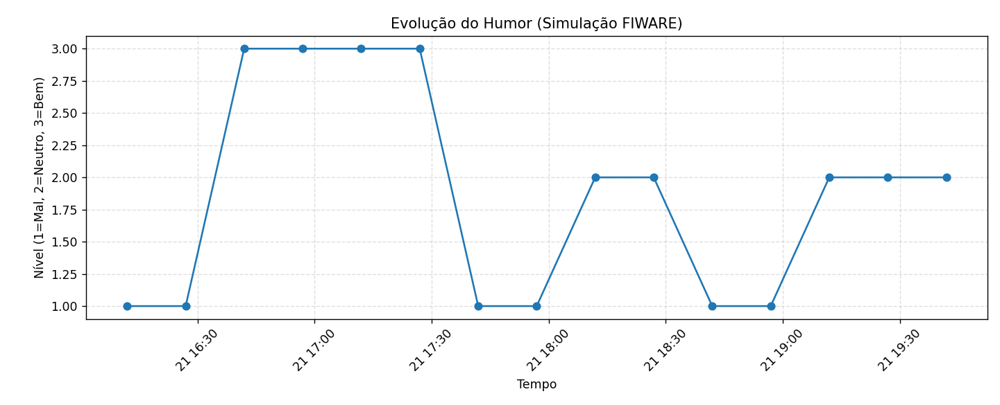

# FuturionHub — Module IoT Edge
### Global Solution — Edge Computing & Computer Systems  
### FIAP — O Futuro do Trabalho

---

## 1. Descrição Geral do Projeto

O módulo **FuturionHub — IoT Edge** demonstra como dispositivos IoT podem integrar-se com plataformas corporativas modernas, gerando telemetria relevante para análise de comportamento e produtividade no contexto do Futuro do Trabalho.

Este módulo simula a conexão entre:

- Dispositivo IoT ESP32  
- FIWARE (IoT Agent, Orion Context Broker, STH-Comet)  
- Azure VM  
- Dashboard Python  
- Plataforma FuturionHub (Web)

O objetivo é recriar, de forma educacional e demonstrativa, o fluxo real de dados entre hardware, middleware e aplicações de análise.

## 2. Objetivo do Módulo IoT

O sistema é responsável por demonstrar como eventos de plataforma (como login e humor do usuário) podem ser coletados, enviados e processados por uma arquitetura FIWARE.

O dispositivo IoT simula:

### 2.1. LoginEvent  
Representa momentos de acesso do usuário à plataforma digital.

Exemplo:
json
{
  "username": "usuario",
  "timestamp": "2025-11-21T12:00:00"
}

2.2. MoodEvent

Registra o estado de humor do usuário, parte do pilar de bem-estar da plataforma.

{
  "username": "usuario",
  "mood": "bem",
  "timestamp": "2025-11-21T12:05:00"
}

3. Arquitetura da Solução

A solução segue o padrão FIWARE com três camadas distintas:

3.1. Camada IoT (Edge) — ESP32

Simulação no Wokwi

Envio periódico de LoginEvent e MoodEvent

Comunicação via MQTT

Integração com IoT Agent (MQTT → NGSI-v2)

3.2. Camada Backend (Cloud / FIWARE / Azure)

Hospedada em uma máquina virtual Ubuntu executando:

| Componente            | Porta | Função                           |
| --------------------- | ----- | -------------------------------- |
| Mosquitto MQTT Broker | 1883  | Recebe telemetria do ESP32       |
| IoT Agent MQTT        | 4041  | Tradução MQTT/NGSI-v2            |
| Orion Context Broker  | 1026  | Estado atual das entidades       |
| STH-Comet             | 8666  | Registro histórico (time series) |
| MongoDB               | 27017 | Banco de dados do Orion e do STH |

3.3. Camada Application (Dashboard e Frontend)

Dashboard Python (Streamlit)

Geração de gráficos:

Média de humor

Evolução temporal do humor

Logins por hora (histograma)

Integração com a plataforma FuturionHub (Web)

4. Estrutura do Repositório

/
├── backend-dashboard/
│   ├── dashboard.py
│   └── requirements.txt
│
├── configuracao-postman/
│   └── futurionhub_FIWARE.json
│
├── dispositivo-iot/
│   ├── diagram.json
│   └── esp32_futurion.ino
│
└── README.md

5. Funcionamento do ESP32 (Simulado)

O ESP32 conecta-se ao WiFi e ao broker MQTT na Azure.
Ele envia periodicamente dados simulados em formato JSON compatível com o IoT Agent.

Exemplo de telemetria enviada:

{
  "username": "breno",
  "mood": "neutro",
  "timestamp": "2025-11-21T13:00:00"
}

O IoT Agent converte e publica no Orion, que imediatamente registra o dado no histórico via STH-Comet.

6. Instalação e Execução
6.1. Backend (FIWARE)

- Criar VM Linux na Azure

- Instalar Docker e Docker Compose

- Clonar e iniciar o FIWARE:

git clone https://github.com/fabiocabrini/fiware.git
cd fiware
sudo docker-compose up -d

Liberar portas no NSG:

1883

4041

1026

8666

27017

Criar no Postman (collection já inclusa no repo):

Service Group

Device

Entity Template

Subscriptions

2️⃣ Dispositivo IoT (Wokwi)

Abrir:
dispositivo-iot/diagram.json
esp32_futurion.ino

Rodar simulação → o console mostrará:
Enviando LoginEvent...
Enviando MoodEvent...

3️⃣ Dashboard Python

Instalar dependências:
pip install -r backend-dashboard/requirements.txt

Rodar:
streamlit run dashboard.py

Abrirá automaticamente com:

✔ Login por hora

✔ Média de humor

✔ Linha de evolução emocional
📊 7. Resultados Obtidos (PoC Demonstrativa)

Os gráficos gerados mostram, a partir dos dados simulados:

⭐ Média de humor

Representa o estado emocional médio dos colaboradores.

⭐ Estatísticas temporais

Mostra a evolução, simulada, dos registros ao longo do tempo.

⭐ Logins por hora

Demonstra o comportamento de acesso à plataforma.

👥 8. Equipe de Desenvolvimento

Breno Gonçalves Báo — RM 564037
Arthur Araújo Tenório — RM 562272

📄 9. Licença

Uso educacional.
Este projeto simula um ecossistema corporativo real para fins de aprendizado de IoT + FIWARE + Dashboard.
