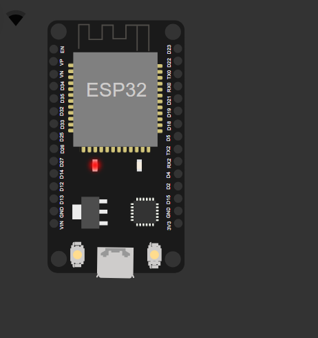
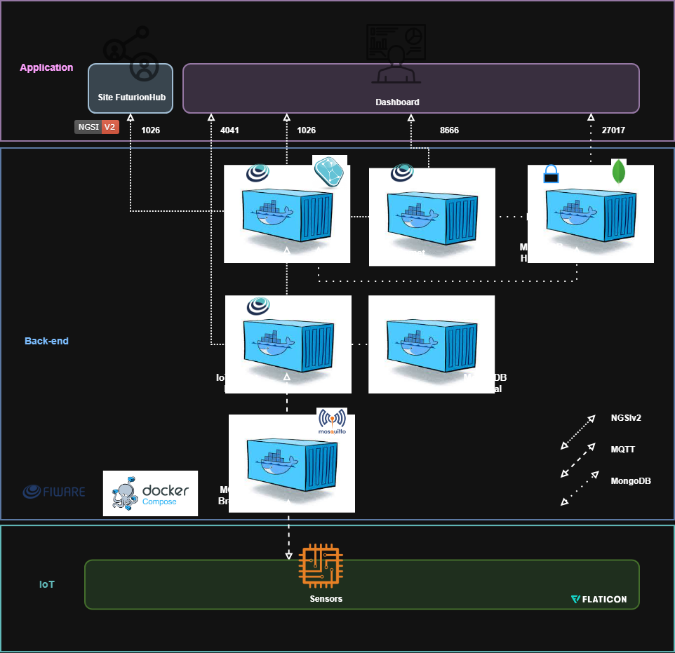

# FuturionHub — Module IoT Edge
### Global Solution — Edge Computing & Computer Systems  
### FIAP — O Futuro do Trabalho

---

## 1. Descrição Geral do Projeto

O módulo **FuturionHub — IoT Edge** demonstra uma arquitetura educacional baseada em FIWARE para envio e análise de telemetria IoT no contexto do Futuro do Trabalho.

Este módulo simula o fluxo completo:
- Dispositivo IoT (ESP32)
- FIWARE (IoT Agent, Orion, STH-Comet, MongoDB)
- Dashboard analítico em Python
- Eventos da plataforma FuturionHub (LoginEvent e MoodEvent)

Embora o modelo funcional completo seja possível, este repositório apresenta uma **demonstração arquitetural** para fins educacionais.



---

## 2. Objetivo do Módulo

A solução demonstra como dados de interação do colaborador podem ser enviados por um dispositivo IoT e armazenados no FIWARE para análise.

Eventos simulados:

### 2.1. LoginEvent
Representa acessos do usuário à plataforma.

```json
{
  "username": "usuario",
  "timestamp": "2025-11-21T12:00:00"
}
2.2. MoodEvent
Estado emocional do usuário, voltado para saúde mental e produtividade.

json
Copiar código
{
  "username": "usuario",
  "mood": "neutro",
  "timestamp": "2025-11-21T12:05:00"
}
Estes dados alimentam o Dashboard de Análise.

3. Arquitetura da Solução



3.1. Visão Geral
O sistema segue uma arquitetura FIWARE com três camadas:

css
Copiar código
[ ESP32 ] → [ MQTT Broker ] → [ IoT Agent ] → [ Orion ] → [ STH-Comet ] → [ MongoDB ]
                                                           ↓
                                                    [ Dashboard ]
4. Componentes da Arquitetura
4.1. IoT Edge (ESP32)
Executa firmware simulando envio de LoginEvent e MoodEvent.

Publica mensagens MQTT.

Integrado ao IoT Agent (MQTT → NGSI-v2 → Orion).

4.2. Backend (FIWARE)
Componente	Porta	Função
Mosquitto MQTT Broker	1883	Recebimento de telemetria do ESP32
IoT Agent MQTT	4041	Tradução MQTT para NGSI-v2
Orion Context Broker	1026	Estado atual das entidades
STH-Comet	8666	Histórico (séries temporais)
MongoDB	27017	Banco de dados Mongo

4.3. Dashboard (Python Streamlit)
Exibe métricas analíticas:

Média de humor

Evolução temporal do humor

Logins por hora

5. Estrutura do Repositório
bash
Copiar código
/
├── backend-dashboard/
│   ├── dashboard.py
│   └── requirements.txt
│
├── configuracao-postman/
│   └── futurionhub_FIWARE.json
│
├── dispositivo-iot/
│   ├── diagram.json
│   └── esp32_futurion.ino
│
└── README.md
6. Funcionamento do IoT (ESP32)
O firmware simula o envio periódico de dados:

json
Copiar código
{
  "username": "breno",
  "mood": "bem",
  "timestamp": "2025-11-21T13:00:00"
}
Esses dados passam por:

nginx
Copiar código
ESP32 MQTT → IoT Agent → Orion → STH-Comet
7. Instalação e Execução
7.1. Backend — FIWARE
bash
Copiar código
sudo apt update
sudo apt install docker.io docker-compose -y

git clone https://github.com/fabiocabrini/fiware.git
cd fiware
sudo docker-compose up -d
Abrir portas na Azure:
1883
4041
1026
8666
27017
8050
Importar collection no Postman:
configuracao-postman/futurionhub_FIWARE.json

7.2. IoT Device — Wokwi
Abrir dispositivo-iot/diagram.json

Abrir esp32_futurion.ino

Configurar endereço do broker MQTT

Iniciar simulação

7.3. Dashboard Python
Instalar dependências:

bash
Copiar código
pip install -r backend-dashboard/requirements.txt
Executar:

bash
Copiar código
streamlit run dashboard.py
O dashboard exibirá:

Evolução dos registros de humor

Média de humor


Logins por hora


8. Resultados Demonstrativos
A partir dos dados simulados pelo ESP32, o Dashboard faz a análise:

Relação entre humor e horários do dia

Frequência de login

Tendências emocionais

Visualização estatística para insights de RH

O fluxo demonstrativo é equivalente ao de um sistema produtivo.


👥 9. Equipe de Desenvolvimento

Breno Gonçalves Báo — RM 564037
Arthur Araújo Tenório — RM 562272

📄 10. Licença

Uso educacional.
Este projeto simula um ecossistema corporativo real para fins de aprendizado de IoT + FIWARE + Dashboard.